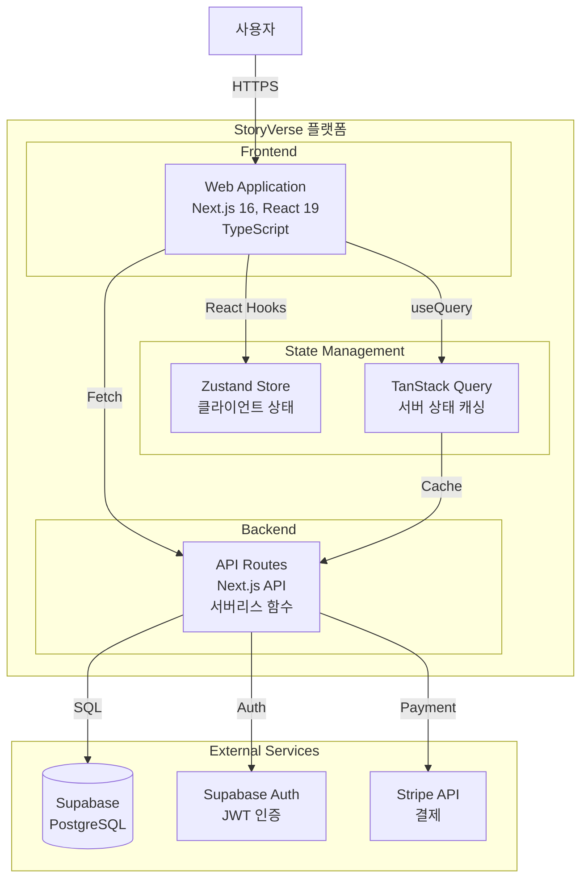

# C4 Model - Level 2: Container Diagram

> 시스템 내부의 주요 컨테이너(애플리케이션, 데이터베이스)와 그 관계

## 다이어그램



## 컨테이너 상세

### Web Application (Next.js Frontend)

| 속성          | 값                                          |
| ------------- | ------------------------------------------- |
| **기술**      | Next.js 16, React 19, TypeScript            |
| **역할**      | 사용자 인터페이스, SSR/SSG                  |
| **배포**      | Vercel Edge Network                         |
| **주요 기능** | 페이지 렌더링, 폼 처리, 클라이언트 인터랙션 |

```
src/app/
├── page.tsx              # 메인 페이지
├── novel/[id]/           # 소설 상세
├── author/dashboard/     # 작가 대시보드
└── (auth)/               # 인증 페이지
```

### API Routes (Backend)

| 속성         | 값                            |
| ------------ | ----------------------------- |
| **기술**     | Next.js API Routes (서버리스) |
| **역할**     | 비즈니스 로직, DB 접근, 인증  |
| **배포**     | Vercel Serverless Functions   |
| **타임아웃** | 10초 (vercel.json 설정)       |

```
src/app/api/
├── auth/         # 인증 (login, register, logout)
├── novels/       # 소설 CRUD
├── comments/     # 댓글
├── payment/      # 결제
└── health/       # 헬스 체크
```

### Database (Supabase PostgreSQL)

| 속성     | 값                             |
| -------- | ------------------------------ |
| **기술** | PostgreSQL 15                  |
| **역할** | 데이터 영속성                  |
| **보안** | Row Level Security (RLS)       |
| **연결** | Connection Pooling (PgBouncer) |

**주요 테이블:**

- `users` - 사용자 정보
- `authors` - 작가 프로필
- `novels` - 소설 메타데이터
- `chapters` - 챕터 콘텐츠
- `coin_transactions` - 코인 거래 내역
- `reading_history` - 독서 기록

### State Management

| 도구               | 용도                            |
| ------------------ | ------------------------------- |
| **Zustand**        | 클라이언트 전역 상태 (UI, 설정) |
| **TanStack Query** | 서버 데이터 캐싱, 동기화        |

## 통신 프로토콜

| From           | To      | 프로토콜 | 인증             |
| -------------- | ------- | -------- | ---------------- |
| User → Web     | HTTPS   | -        | Session Cookie   |
| Web → API      | HTTPS   | REST     | JWT Bearer Token |
| API → Supabase | TCP/SSL | SQL      | Service Role Key |
| API → Stripe   | HTTPS   | REST     | API Secret Key   |

## 보안 고려사항

1. **인증**: Supabase Auth JWT, HttpOnly Cookie
2. **API 보안**: Rate Limiting, CORS 설정
3. **DB 보안**: RLS 정책, Service Role 분리
4. **결제**: Stripe Webhook 서명 검증
