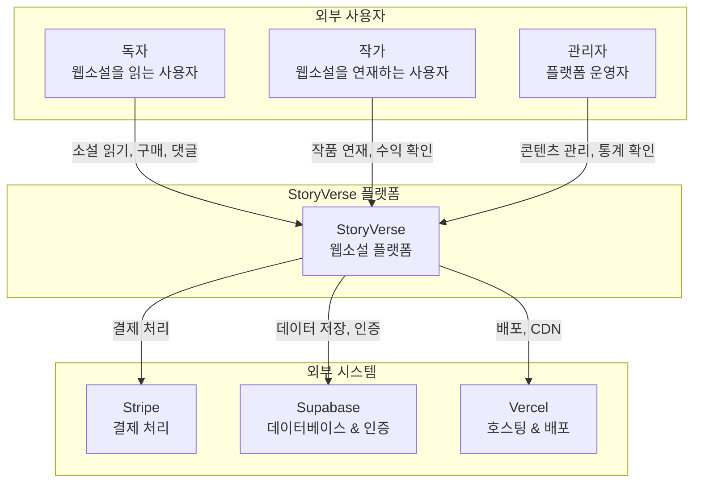

# C4 Model - Level 1: System Context

> 시스템과 외부 사용자/시스템의 관계를 보여주는 최상위 뷰

## 다이어그램

## 구성 요소 설명

### 사용자

| 사용자     | 역할          | 주요 활동                           |
| ---------- | ------------- | ----------------------------------- |
| **독자**   | 콘텐츠 소비자 | 소설 탐색, 읽기, 구매, 댓글, 팔로우 |
| **작가**   | 콘텐츠 생산자 | 작품 등록, 챕터 연재, 수익 관리     |
| **관리자** | 플랫폼 운영자 | 콘텐츠 검수, 이벤트 관리, 통계 분석 |

### 외부 시스템

| 시스템       | 용도                       | 연동 방식           |
| ------------ | -------------------------- | ------------------- |
| **Stripe**   | 코인 충전, VIP 구독 결제   | REST API, Webhook   |
| **Supabase** | PostgreSQL DB, 사용자 인증 | Supabase Client SDK |
| **Vercel**   | 서버리스 호스팅, Edge CDN  | Git 자동 배포       |

## 데이터 흐름

1. **독자 흐름**: 로그인 → 소설 탐색 → 챕터 구매/읽기 → 댓글/별점
2. **작가 흐름**: 로그인 → 작품 관리 → 챕터 업로드 → 수익 확인
3. **결제 흐름**: 코인 충전 → Stripe 결제 → Webhook → DB 업데이트
